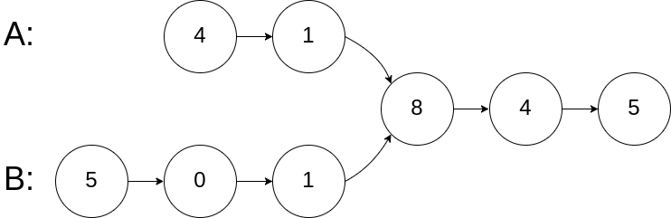

# 相交链表

## 题目

编写一个程序，找到两个单链表相交的起始节点。

如下面的两个链表：


在节点 c1 开始相交。

示例 1：



	输入：intersectVal = 8, listA = [4,1,8,4,5], listB = [5,0,1,8,4,5], skipA = 2, skipB = 3
	输出：Reference of the node with value = 8
	输入解释：相交节点的值为 8 （注意，如果两个链表相交则不能为 0）。从各自的表头开始算起，链表 A 为 [4,1,8,4,5]，链表 B 为 [5,0,1,8,4,5]。在 A 中，相交节点前有 2 个节点；在 B 中，相交节点前有 3 个节点。
	 

示例 2：


	输入：intersectVal = 2, listA = [0,9,1,2,4], listB = [3,2,4], skipA = 3, skipB = 1
	输出：Reference of the node with value = 2
	输入解释：相交节点的值为 2 （注意，如果两个链表相交则不能为 0）。从各自的表头开始算起，链表 A 为 [0,9,1,2,4]，链表 B 为 [3,2,4]。在 A 中，相交节点前有 3 个节点；在 B 中，相交节点前有 1 个节点。
	 

示例 3：


	输入：intersectVal = 0, listA = [2,6,4], listB = [1,5], skipA = 3, skipB = 2
	输出：null
	输入解释：从各自的表头开始算起，链表 A 为 [2,6,4]，链表 B 为 [1,5]。由于这两个链表不相交，所以 intersectVal 必须为 0，而 skipA 和 skipB 可以是任意值。
	解释：这两个链表不相交，因此返回 null。
	 

注意：

如果两个链表没有交点，返回 null.

在返回结果后，两个链表仍须保持原有的结构。

可假定整个链表结构中没有循环。

程序尽量满足 O(n) 时间复杂度，且仅用 O(1) 内存。


链接：https://leetcode-cn.com/problems/intersection-of-two-linked-lists

## code
```cpp
class Solution {
public:
	// 数链表的长度
	int get_len(ListNode* head) {
		int len = 0;
		while (head != NULL){
			head = head->next;
			len++;
		}
		return len;
	}
	ListNode* getIntersectionNode(ListNode* headA, ListNode* headB) {
		int lenA = 0, lenB = 0;
		lenA = get_len(headA);
		lenB = get_len(headB);

		int diff = abs(lenA - lenB); // 找准差距
		
		// 笨鸟先飞走两步
		if (lenA < lenB) 
			for (int i = 0; i < diff; i++) headB = headB->next;
		else
			for (int i = 0; i < diff; i++) headA = headA->next;
		
		// 总会走到交点的
		while (true){
			if (headA == headB) return headA;
			headA = headA->next;
			headB = headB->next;
		}
	}
};
```

另外可见 @nuclear fusion 的浪漫般的代码
([地址](https://leetcode-cn.com/problems/intersection-of-two-linked-lists/comments/293795))

```cpp
class Solution {
public:
    ListNode *getIntersectionNode(ListNode *headA, ListNode *headB) {
        if (!headA || !headB) {
            return NULL;
        }
        ListNode *you = headA, *she = headB;
        while (you != she) { // 若是有缘，你们早晚会相遇
            you = you ? you->next : headB; // 当你走到终点时，开始走她走过的路
            she = she ? she->next : headA; // 当她走到终点时，开始走你走过的路
        }
        // 如果你们喜欢彼此，请携手一起走完剩下的旅程（将下面这个 while 块取消注释）。
        // 一路上，时而你踩着她的影子，时而她踩着你的影子。渐渐地，你变成了她，她也变
        // 成了你。
        /* while (she) {
            you = she->next;
            she = you->next;
        } */
        return you;
    }
};
```